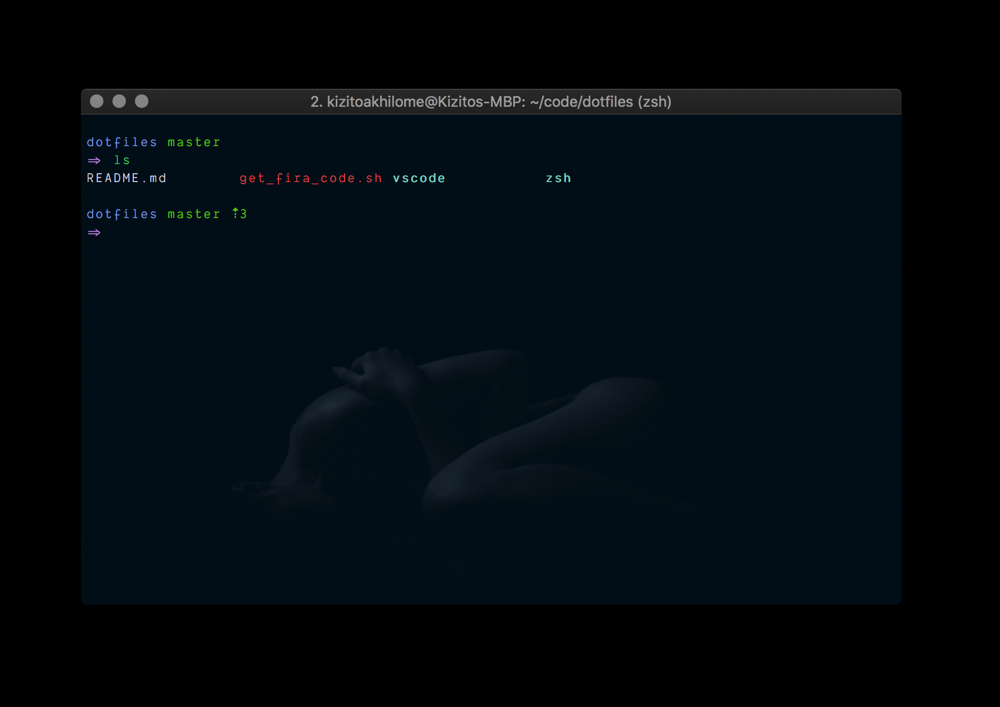
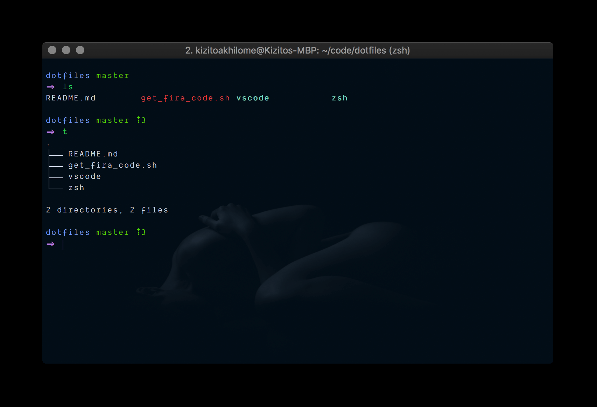

# Configuring ZSH

Some shot's of the current terminal UI:



ls-ing with `tree`:



VS Code's integrated terminal:


## Installing ZSH

- For Ubuntu/Deb, get the package from apt:

```sh
sudo apt update && sudo apt install zsh
```

- For Mac (using homebrew)

```sh
brew install zsh
```

- create empty zshrc

```sh
echo '# ZSH!!!' > ~/.zshrc
```

- change default shell to zsh:

```sh
sudo chsh -s $(which zsh)
```

## Installing OhMyZSH

ensure you have `curl` installed:

```sh
which curl
```

if not, install it:

```sh
sudo apt install curl # for ubuntu/deb

brew install curl # for mac (using homebrew)
```

- install ohmyzsh

```sh
sh -c "$(curl -fsSL https://raw.githubusercontent.com/robbyrussell/oh-my-zsh/master/tools/install.sh)"
```

## Installing Theme

- Install Powerlevel10k:

```sh
git clone --depth=1 https://github.com/romkatv/powerlevel10k.git $ZSH_CUSTOM/themes/powerlevel10k
```

- Save `.purepower` to `~`

## Installing Plugins

- Install the zsh-syntax-highlighting plugin:

```sh
git clone --depth=1 https://github.com/zsh-users/zsh-syntax-highlighting.git ${ZSH_CUSTOM:-~/.oh-my-zsh/custom}/plugins/zsh-syntax-highlighting
```

- Install the zsh-autosuggestions plugin:

```sh
git clone --depth=1 https://github.com/zsh-users/zsh-autosuggestions ${ZSH_CUSTOM:-~/.oh-my-zsh/custom}/plugins/zsh-autosuggestions
```

## Putting It All Together

copy the content of `.zshrc` into `~/.zshrc` making modifications as required.
